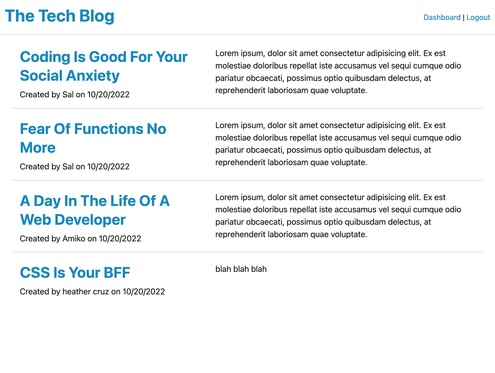
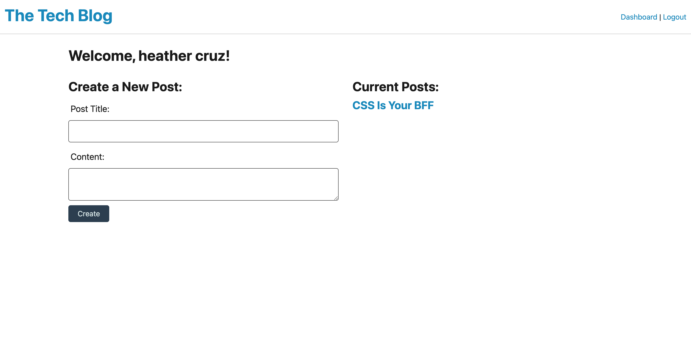
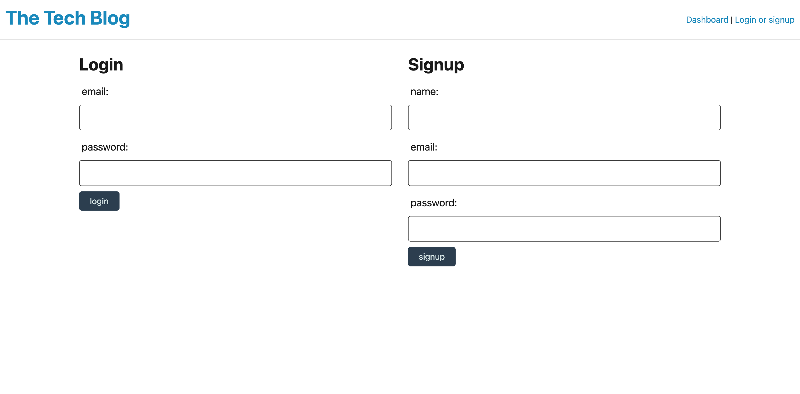

# Tech Blog

## Description

This application is a site built for tech enthusiasts to publish articles, blog posts, thoughts and opinions.  

## Usage
The user is presented with the home page of articles.  The user must click the right upper corner to login or signup, in which the user is 
then directed to the login page.  Once logged in, the user will then be directed to the dashboard page, where new posts may be created, or their
previous posts may be chosen to edit or delete.  When the user clicks a previous post to edit, that post is displayed with the option to update or delete.  If update is chosen, the user is directed to an update form of that particular post.  
The option to comment on posts will be added in the future.

## Link

[Github](https://hcruz77.github.io/tech-blog/)

